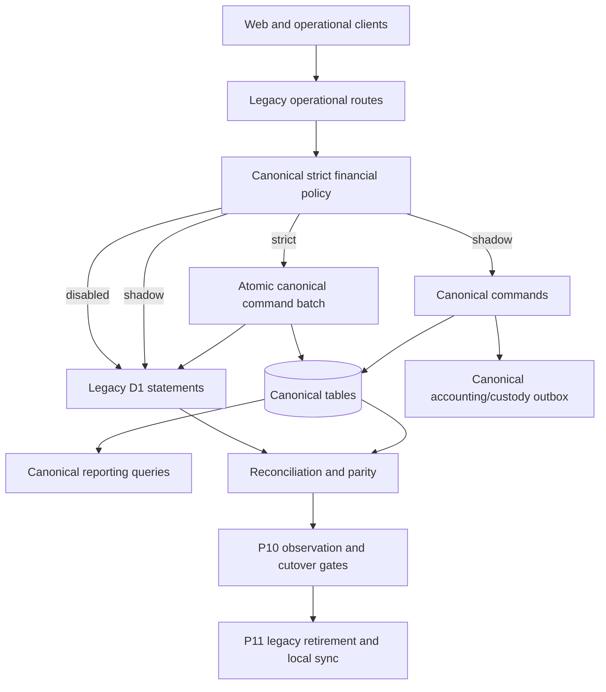

# Main Canonical Completion and Gap Audit

**Date:** 2026-07-21

**Repository:** `/Users/rahmatullahzisan/Desktop/Dev/hms`

**Audited source of truth:** `main` at `fa742f4960a4bef35950bdb4c5a6a6f251782f8e`

**Continuation branch:** `program/canonical-main-continuous-20260721`

**Continuation worktree:** `/Users/rahmatullahzisan/Desktop/Dev/hms/.worktrees/canonical-main-continuous`

## 1. Audit question

Determine from current `main`, rather than from an older review workspace, how much of the HMS canonical data and financial architecture is genuinely complete, what remains locally implementable, what remains production-gated, and which prior planning artifacts are stale or duplicate.

## 2. Executive conclusion

The canonical program was already merged to `main`. The authoritative implementation is the `src/lib/canonical/**`, `src/db/schema/canonical/**`, `scripts/canonical/**`, `test/canonical/**`, and migrations `0505`–`0518` family.

The old dirty `review/all-branches-20260711` workspace is not the canonical program base. Its uncommitted `src/lib/financial-reconciliation/**` and migrations `0424`–`0431` form a competing architecture and must not be imported wholesale.

Current completion is best described as:

- **P00–P09 architecture, schema, commands, backfills, reporting and rehearsal:** complete and verified on current `main`.
- **P10 production cutover:** partially complete. Invoice creation and payment collection have strict/shadow canonical runtime wiring; deposit collection/refund/application, credit-note/refund approval, and payment reversal still execute legacy mutations without the same canonical strict/shadow wrapper.
- **P11 legacy retirement and local-sync reintroduction:** pending and intentionally authorization-gated.

Measured progress:

| Measure | Result |
|---|---:|
| Completed phases | 10 of 12, with P10 partial |
| Completed tracker tasks | 20 of 24, with CDB-101 partial |
| Core local architecture/readiness | approximately 90%+ |
| Whole program including cutover, observation, retirement and local sync | approximately 75–80% |

The next safe local checkpoint is **not** production mutation. It is completing strict/shadow runtime coverage for the remaining financial boundaries, proving it with route-level tests, and then re-running the full canonical verification pack.

## 3. Git and branch evidence

### Canonical lineage

- Historical canonical branch: `feature/hms-canonical-data-architecture`.
- Canonical synchronization merge in `main`: `21a4f78d5 — merge: synchronize canonical integration updates`.
- The historical canonical branch is an ancestor of current `main`.
- Current `main` and `origin/main`: `fa742f4960a4bef35950bdb4c5a6a6f251782f8e`.

### Rejected bases

- `review/all-branches-20260711` does not contain current `main` and is not a canonical program branch.
- `integration/main-unified-20260719` is one unique commit ahead but nine commits behind current `main`; using it would remove or revert later billing, refund custody, IPD deposit and commission fixes.
- `program/canonical-finance-continuous-execution-20260721` was created from the wrong review base and must remain unused.

## 4. Current architecture map

### Authoritative components

| Component | Authoritative paths | Status |
|---|---|---|
| Canonical schemas | `src/db/schema/canonical/**`, migrations `0505`–`0518` | Complete |
| Canonical command batch/idempotency | `src/lib/canonical/command-batch.ts`, `idempotency.ts` | Complete |
| Invoice command | `commands/issue-invoice.ts` | Complete and route-wired |
| Payment command | `commands/collect-payment.ts` | Complete and route-wired |
| Deposit commands | `commands/apply-deposit.ts` | Command-complete, route wiring incomplete |
| Credit note command | `commands/issue-credit-note.ts` | Command-complete, route wiring incomplete |
| Payment reversal command | `commands/reverse-payment.ts` | Command-complete, route wiring incomplete |
| Compensation, inventory and accounting | canonical commands/projections/poster/backfills | Complete at program/rehearsal level |
| Canonical reporting | `src/lib/canonical/reporting/**`, route and parity tests | Complete locally; production promotion gated |
| Production tooling | `scripts/canonical/**`, protected evidence contracts | Complete locally; execution authorization-gated |

## 5. Verification performed from current main

All commands were run from the clean main-based continuation worktree.

| Command | Result |
|---|---|
| `pnpm vitest run test/canonical` | 78 files, 612 tests passed |
| `pnpm build:migrations` | 453 migrations generated successfully |
| `pnpm exec tsc --noEmit` | passed after required migration generation |
| `pnpm canonical:check` | 0 governance issues |
| `pnpm build` | full web, patient and admin production builds passed |

The initial TypeScript failure was environmental setup in the fresh worktree: `src/data/schema-migrations.generated.ts` had not yet been generated. Running the documented migration build resolved it without source-code modification.

## 6. Phase completion matrix

| Phase | Tracker status | Audit verdict |
|---|---|---|
| P00 Planning baseline | completed | complete |
| P01 Production truth and clone rehearsal | completed | complete |
| P02 Governance and canonical foundation | completed | complete |
| P03 Practitioner/encounter foundation | completed | complete |
| P04 Service catalog/operations | completed | complete |
| P05 Canonical invoicing | completed | complete and runtime-wired |
| P06 Payments/deposits/credits/refunds | completed | command/rehearsal complete; route wiring partially incomplete |
| P07 Compensation and IPD projections | completed | complete locally |
| P08 Inventory/cash/accounting | completed | complete locally |
| P09 Canonical reporting | completed | complete locally; production promotion gated |
| P10 Production domain cutovers | in progress | partial; local route-hardening plus production observation remain |
| P11 Retirement/local sync | pending | not started and authorization-gated |

## 7. Runtime coverage gap

`STRICT_FINANCIAL_BOUNDARIES` declares:

- `billing.create`
- `billing-counter.invoice.create`
- `billing.payment.collect`
- `deposit.collect`
- `deposit.refund`
- `deposit.apply`
- `credit-note.approve`

Current route usage shows:

- `billing.create` uses `executeStrictFinancialMutation` and `issueInvoice`.
- `billing.payment.collect` uses `executeStrictFinancialMutation` and `collectPayment`.
- Deposit collect/refund/adjust routes use legacy D1 batches plus the older cash-ledger shadow writer, but do not call `recordDeposit`, `refundDeposit`, or `applyDeposit` through `executeStrictFinancialMutation`.
- Approval payment void uses a legacy reversal batch and does not call canonical `reversePayment`.
- Refund/credit-note approval uses legacy credit-note and refund batches and does not call canonical `issueCreditNote` or `reversePayment`.
- `assertStrictFinancialBoundaryDisabledOrSupported` currently has no route caller, so unsupported financial routes are not globally fail-closed under strict mode.

This explains why production manual QA passed invoice/payment but could not establish complete reversal/refund/cancellation canonical evidence.

## 8. Tracker inconsistencies

`task-progress.yaml` contains valid historical evidence but its top-level current state mixes different dates and operational moments:

- old program branch/worktree and base commit;
- an expired historical production authorization represented as currently active;
- CDB-101 fields describing disabled shadow mode alongside later handoff evidence showing Tenant-100 shadow version 3;
- P06 marked complete without distinguishing command/rehearsal completion from route integration completion.

The tracker must preserve history while adding a current-main continuation checkpoint and resetting production authorization to false for this session.

## 9. Superseded duplicate architecture

The following dirty-review artifacts are not authoritative and must not become a second source of financial truth:

- `src/lib/financial-reconciliation/**`
- `src/lib/financial-event-outbox.ts`
- review-only migrations `0424`–`0431`
- the review-root Stage 0–4 plan that assumed those paths were the canonical foundation

Useful requirements or tests may be manually re-evaluated, but any implementation must extend `src/lib/canonical/**` and the existing `0505`–`0518` schema family.

## 10. Prioritized remaining work

### Priority 0 — main-based governance and route coverage

1. Correct tracker, handoff and planning source to current `main`.
2. Add a route-coverage contract that maps every strict financial boundary to an actual runtime integration.
3. Keep production mutation disabled.

### Priority 1 — adjustment runtime integration

1. Wire deposit collection to `recordDeposit`.
2. Wire deposit refund to `refundDeposit`.
3. Wire deposit application/adjustment to `applyDeposit`.
4. Wire payment void to `reversePayment`.
5. Wire approved credit-note/refund paths to `issueCreditNote` and, when cash is returned against a payment, the appropriate canonical refund/reversal lifecycle.
6. Preserve existing accounting, cash-hold, commission, clinical cancellation and legacy behavior atomically.

### Priority 2 — local cutover gate

Run route-level regressions, all canonical tests, TypeScript, schema governance, migration build and full production build. Require zero missing runtime boundaries and no duplicate canonical authority.

### Priority 3 — P10 production evidence

Only with fresh explicit authorization:

- deploy/confirm the reviewed build;
- run controlled refund/reversal/cancellation QA;
- capture protected reconciliation and observation evidence;
- verify rollback;
- decide whether canonical read/write promotion is allowed.

### Priority 4 — P11

After P10 passes and separate authorization:

- stop legacy writes;
- create compatibility reads;
- remove direct SQL/adapters;
- rebuild local sync on canonical public IDs;
- perform final destructive retirement only with explicit approval.

## 11. Stop conditions

Stop local implementation and request a decision when:

- the legacy and canonical mutation cannot commit atomically;
- an original receipt/allocation/invoice mapping is missing and cannot be deterministically reconstructed;
- a paid compensation/reserve blocks reversal;
- a migration would duplicate or destructively alter canonical tables;
- a route requires production data or credentials to verify;
- production deployment, flag, import, backfill, observation or retirement is the next action.

## 12. Final audit verdict

Current `main` is the correct base and already contains the substantial canonical program. The program is not finished, but it should be continued by closing the remaining strict/shadow route integrations and then completing P10 production evidence. Starting again from the dirty review branch would duplicate the architecture and lose current-main fixes.
