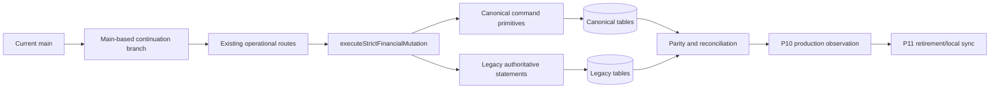

# Main-Based Canonical Continuation Design

## Status

Approved for local implementation by the user on 2026-07-21. Production mutation is not authorized by this document.

## Problem

The HMS canonical data architecture is already present in `main`, but its tracker and continuation instructions still point to an older program branch and manual multi-agent workflow. A separate dirty review workspace also contains a second financial-reconciliation architecture that overlaps the real canonical system.

The current program must continue from `main` without duplicating canonical tables, commands, outbox logic or migrations. Before production cutover can resume, every declared strict financial mutation boundary must actually route through the canonical strict/shadow execution layer.

## Goals

1. Use current `main` as the immutable continuation base.
2. Continue in one persistent branch/worktree with one agent.
3. Preserve the canonical architecture under `src/lib/canonical/**` and migrations `0505`–`0518`.
4. Complete runtime strict/shadow wiring for remaining adjustment and reversal boundaries.
5. Keep legacy behavior and canonical writes atomic in strict mode and non-blocking in shadow mode.
6. Prove local readiness before requesting any new production authorization.
7. Preserve historical production evidence while correcting stale current-state fields.

## Non-goals

- Importing `src/lib/financial-reconciliation/**` as a second canonical authority.
- Reusing review-only migrations `0424`–`0431`.
- Deploying, changing traffic, applying remote migrations, enabling flags, running production backfills, or mutating tenant data without a fresh explicit authorization.
- Retiring legacy writes or re-enabling local sync before P10 passes.

## Execution identity

- Executor: `CDB-CONTINUE`
- Base branch: `main`
- Base commit: `fa742f4960a4bef35950bdb4c5a6a6f251782f8e`
- Branch: `program/canonical-main-continuous-20260721`
- Worktree: `/Users/rahmatullahzisan/Desktop/Dev/hms/.worktrees/canonical-main-continuous`

The executor makes multiple logical checkpoint commits and continues after normal commits. It stops only for context/execution limits, an unsafe repository state, an external accounting/product decision, a production/observation gate, or full completion.

## Authority model

## Runtime behavior

### Disabled policy

The legacy statement batch executes exactly as it does today. No canonical write is attempted.

### Shadow policy

The legacy batch commits first and remains authoritative. The canonical command runs afterward. A canonical failure is recorded/logged but does not fail the legacy request. Reconciliation exposes divergence.

### Strict policy

The canonical command receives the legacy statements as `authoritativeStatements`, and `runCanonicalBatch` commits canonical and legacy mutations in one D1 batch. Any canonical validation or batch failure fails the request without a partial legacy commit.

## Boundary inventory

| Boundary | Existing canonical command | Current route state | Required action |
|---|---|---|---|
| `billing.create` | `issueInvoice` | wired | preserve |
| `billing-counter.invoice.create` | `issueInvoice` or service operation batch | verify existing coverage | add contract evidence/fail-closed guard |
| `billing.payment.collect` | `collectPayment` | wired | preserve |
| `deposit.collect` | `recordDeposit` | legacy-only | wire |
| `deposit.refund` | `refundDeposit` | legacy-only | wire |
| `deposit.apply` | `applyDeposit` | legacy-only | wire |
| `credit-note.approve` | `issueCreditNote` | legacy-only | wire |
| payment reversal | `reversePayment` | legacy-only and not in boundary list | add explicit boundary and wire |
| unpaid bill cancellation | canonical invoice/service cancellation projection may be required | legacy-only | characterize; fail closed in strict mode until supported |

## Identity and mapping rules

Canonical commands require stable public IDs, source identities and evidence hashes. Route adapters must derive them deterministically from the committed legacy authority:

- Invoice mapping comes from `canonical_source_mappings` for the bill/invoice.
- Payment receipt, tender and allocation mappings must be loaded before reversal.
- Deposit mapping must resolve a specific source deposit row; aggregate patient balance alone is insufficient canonical authority.
- Credit-note lines must map to canonical invoice lines where an invoice item exists.
- Idempotency keys must be stable across retries and must not depend on transient timestamps.
- Evidence hashes must be generated from a normalized source snapshot, not arbitrary descriptions.
- Cash custody event IDs must be deterministic and separate from accounting/outbox event IDs.

If a deterministic mapping is absent in shadow mode, the legacy mutation may continue while the canonical write fails visibly. In strict mode the request must fail before any legacy mutation.

## Deposit source selection

Legacy deposit balance is an aggregate of multiple deposit, adjustment and refund rows. Canonical application/refund commands require one specific `canonical_deposits` source. A route adapter must allocate an amount deterministically across mapped deposits, oldest available first, and invoke one canonical command per source deposit in a single canonical command batch or a dedicated multi-source adapter.

The implementation must not invent one aggregate deposit public ID for a patient.

## Refund and reversal distinctions

- A payment void reverses an original receipt/tender/allocation and uses `reversePayment`.
- A deposit refund reduces an available deposit liability and uses `refundDeposit`.
- A credit note reduces invoice value and uses `issueCreditNote`.
- A cash refund arising from a credit note may also require payment/deposit reversal depending on the original settlement source.
- Unpaid bill cancellation is not a payment reversal and must not fabricate refund records.

## Existing side effects to preserve

The adapter must preserve:

- accounting period checks;
- maker-checker approval state;
- billing refund cash holds and reserve release;
- bill/item status and balances;
- income reversal evidence while legacy remains authoritative;
- `emp_cash_transactions` custody evidence;
- accounting posting events;
- commission/reserve cancellation guards;
- laboratory/radiology clinical cancellation;
- audit logs;
- route idempotency and concurrency checks.

## Testing strategy

### Architecture contracts

- The continuation branch is based on current `main`.
- No plan names the dirty review branch as an execution base.
- No new runtime imports from `src/lib/financial-reconciliation/**`.
- Every strict boundary has a registered route adapter or an explicit fail-closed unsupported status.

### Unit tests

- deterministic public IDs/evidence hashes;
- payment/deposit/invoice mapping resolution;
- deposit source allocation;
- tender normalization;
- shadow failure behavior;
- strict atomicity inputs.

### Route tests

For each mutation:

1. disabled mode preserves legacy behavior;
2. shadow mode writes legacy plus canonical facts;
3. shadow canonical failure returns legacy success and records no false completion;
4. strict mode writes legacy plus canonical atomically;
5. strict mode mapping/validation failure writes neither side;
6. retries do not duplicate rows;
7. cross-tenant IDs are rejected.

### Regression gates

- focused route tests;
- `pnpm vitest run test/canonical`;
- `pnpm build:migrations`;
- `pnpm exec tsc --noEmit`;
- `pnpm canonical:check`;
- `pnpm build`.

## Tracker model

Historical task evidence remains immutable. New current-state fields record:

- audited main SHA;
- continuation branch/worktree;
- current local checkpoint;
- latest verification counts;
- remaining runtime boundaries;
- production authorization false;
- exact next action.

Add a local hardening task `CDB-102` between CDB-101's previous shadow activation evidence and any new production observation. CDB-101 remains in progress until CDB-102 passes locally and fresh production observation/authorization completes.

## Checkpoints

1. `CDB-102A` — main audit, tracker and contract baseline.
2. `CDB-102B` — strict boundary registry and route coverage test.
3. `CDB-102C` — deposit collect/refund/apply wiring.
4. `CDB-102D` — payment reversal and credit-note/refund wiring.
5. `CDB-102E` — unpaid cancellation strict policy and aggregate local verification.
6. `CDB-101-RESUME` — fresh authorized production observation.
7. `CDB-105+` — P11 only after P10 gate.

Normal checkpoint commits do not end the executor session.

## Production safety

This design is not production authorization. Fresh authorization must identify:

- environment;
- tenant/domain scope;
- exact action;
- approved Worker/build SHA;
- backup/export and Time Travel evidence;
- rollback owner;
- observation duration and abort thresholds.

Without it, the executor finishes all safe local work and stops at the P10 production gate.
